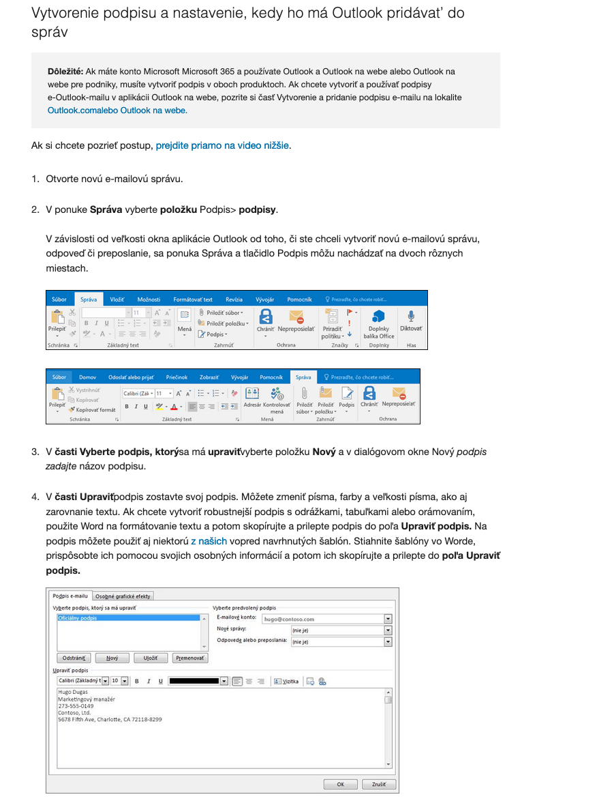
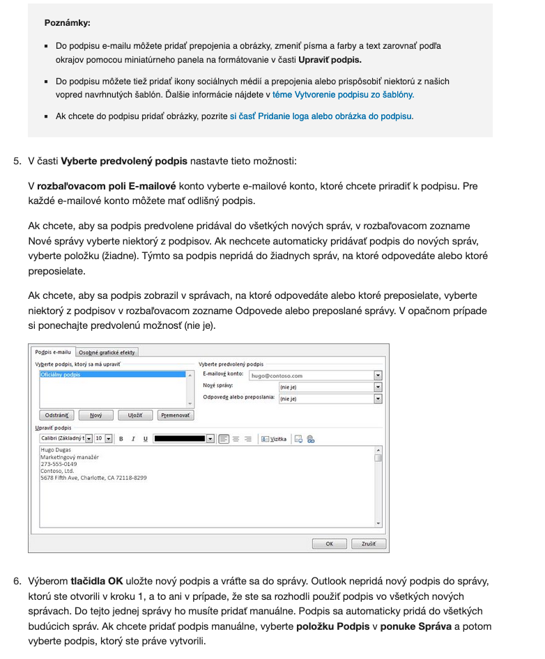

## Opis postupu

- V rámci hore uvedenej __mailovej správy__ je zaslaná už __vygenerovaná vizitka__, ktorú je potrebné celú označiť, skopírovať a následne vložiť do prostredia __Outlook__ (sekcia __podpisy e-mailu/upraviť podpis__, viď nižšie) pomocou nižšie uvedeného postupu. Užívateľ štandardne označí vizitku kurzorom myši, klikne na tlačidlo __kopírovať__ (alebo skratka `Ctrl+C`) a následne vloží kliknutím na tlačidlo __vložiť__ (alebo skratka `Ctrl+V`).

- V prípade __technických otázok__ alebo pomoci môžete kontaktovať priamo správcu [tu](mailto:michal.spano03@gmail.com).

## Výňatok z oficiálnej dokumentácie od Microsoftu

__Odkaz__ na celý dokument je [_tu_](https://support.microsoft.com/sk-sk/office/vytvorenie-a-pridanie-podpisu-do-spr%C3%A1v-8ee5d4f4-68fd-464a-a1c1-0e1c80bb27f2).

\pagebreak

